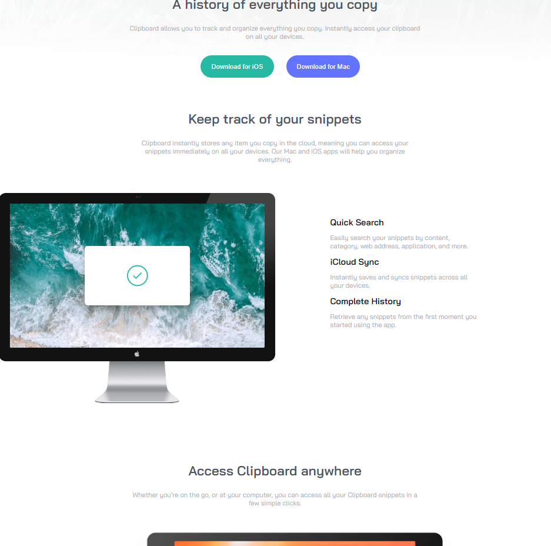

# Clipboard landing page solution

Hi! 

This is a solution to the [Clipboard landing page challenge on Frontend Mentor](https://www.frontendmentor.io/challenges/clipboard-landing-page-5cc9bccd6c4c91111378ecb9). 

### The challenge

Users should be able to:

- View the optimal layout for the site depending on their device's screen size
- See hover states for all interactive elements on the page

### Screenshot

### Links

- Solution URL: [Click](https://domdzia.github.io/Clipboard-landing-page/)

### Built with

- Semantic HTML5 markup,
- CSS,
- Flexbox,
- Media queries.

